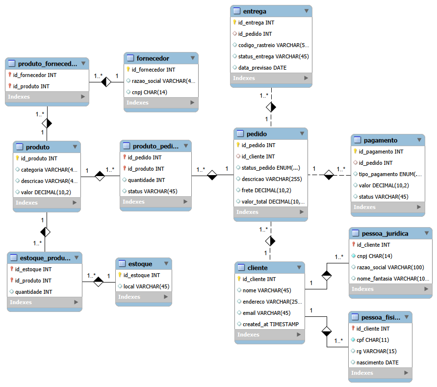
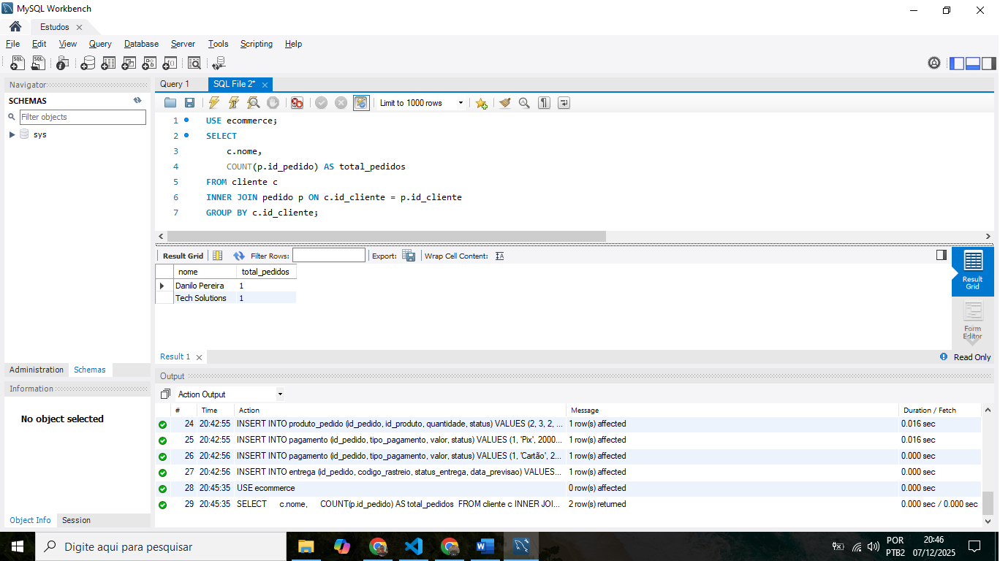
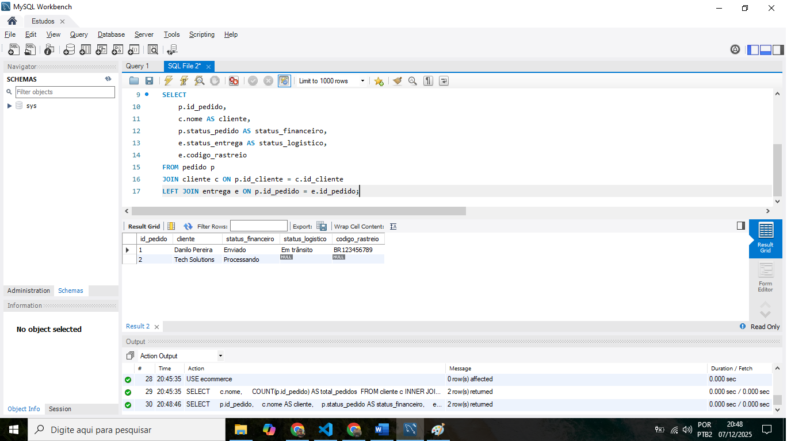
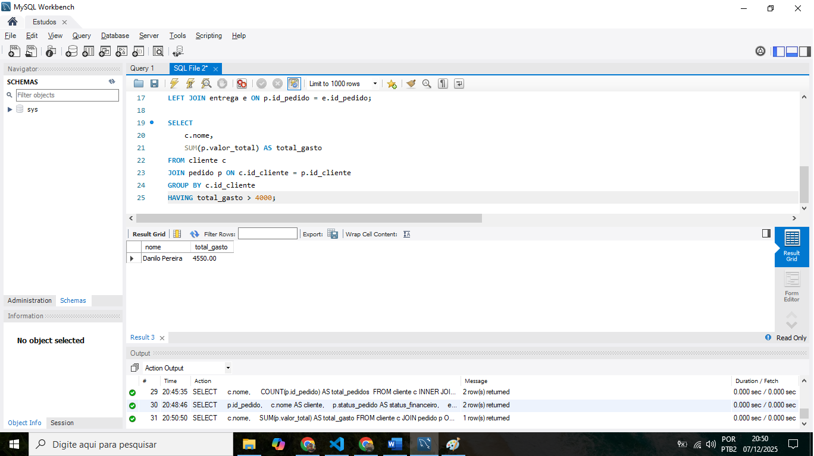

# 🛒 E-commerce Database Project: Do Modelo Conceitual à Implementação SQL

Este projeto consiste na modelagem completa e implementação de um banco de dados relacional para um cenário de E-commerce. 

 objetivo foi refinar um modelo conceitual inicial, transformá-lo em esquema lógico e, finalmente, scriptar a criação física do banco de dados (DDL) e realizar consultas analíticas (DQL).

## 🎯 Objetivos do Desafio

O projeto foi estruturado para resolver lacunas comuns em modelagens simples, atendendo a requisitos de negócio complexos:

1.  **Cliente PJ e PF:** Implementação de especialização/herança para permitir que um cliente seja Pessoa Física (CPF) ou Jurídica (CNPJ), garantindo integridade e evitando redundância.
2.  **Múltiplos Meios de Pagamento:** Desacoplamento da entidade Pagamento para permitir que um único pedido seja pago com múltiplas formas (ex: Cartão + Pix).
3.  **Gestão de Entregas:** Criação de entidade de Entrega independente, permitindo rastreio (Tracking Code) e status logístico separado do status financeiro do pedido.

## 🛠️ Tecnologias Utilizadas

* **MySQL Workbench 8.0:** Modelagem EER e execução de scripts SQL.
* **Linguagem SQL:** DDL (Data Definition Language) para criação e DQL (Data Query Language) para análise.
* **Git/GitHub:** Versionamento e documentação.

## 📊 Modelagem de Dados (Diagrama EER)

Abaixo, o diagrama Entidade-Relacionamento final refinado, aplicando boas práticas como padronização de nomenclatura (*snake_case*) e tipagem correta de dados (*DECIMAL* para valores monetários, *DATE* para datas).

*(Certifique-se de salvar seu print do diagrama na pasta img com este nome)*

### Decisões de Arquitetura:
* **Herança na Tabela Cliente:** A tabela `cliente` armazena dados globais, enquanto `pessoa_fisica` e `pessoa_juridica` armazenam dados específicos, vinculados por FK 1:1.
* **Relacionamentos N:M:** Tabelas associativas criadas para gerenciar produtos por pedido, produtos por fornecedor e produtos em estoque.

## 📂 Estrutura do Projeto

* `script_tabelas.sql`: Script completo contendo a criação do Schema, Tabelas e inserção de dados fictícios para teste.
* `script_perguntas.sql`: Queries complexas elaboradas para responder perguntas de negócio.
* `ecommerce.mwb`: Arquivo fonte da modelagem no MySQL Workbench.

## 🚀 Como Executar

1.  Tenha o MySQL Server instalado localmente.
2.  Abra o arquivo `script_tabelas.sql` no seu cliente MySQL (Workbench, DBeaver, etc.).
3.  Execute todo o script para criar o banco `ecommerce` e popular as tabelas.
4.  Abra o arquivo `script_perguntas.sql` para rodar as análises de negócio.

## 🧠 Análise de Dados (Business Intelligence)

Além da criação do banco, foram elaboradas queries SQL para extrair insights valiosos do negócio.

### 1. Quantos pedidos foram feitos por cada cliente?
Esta consulta utiliza `JOIN` e `GROUP BY` para contar o volume de vendas por consumidor.

### 2. Relação de Pedidos: Status Financeiro vs. Status Logístico
Aqui unimos as tabelas `Pedido` e `Entrega` para verificar se pedidos pagos já foram enviados, cruzando informações críticas para a operação.

### 3. Clientes de Alto Valor (Ticket Médio)
Utilizando a cláusula `HAVING`, filtramos apenas os clientes que somam mais de R$ 4.000,00 em compras totais.

